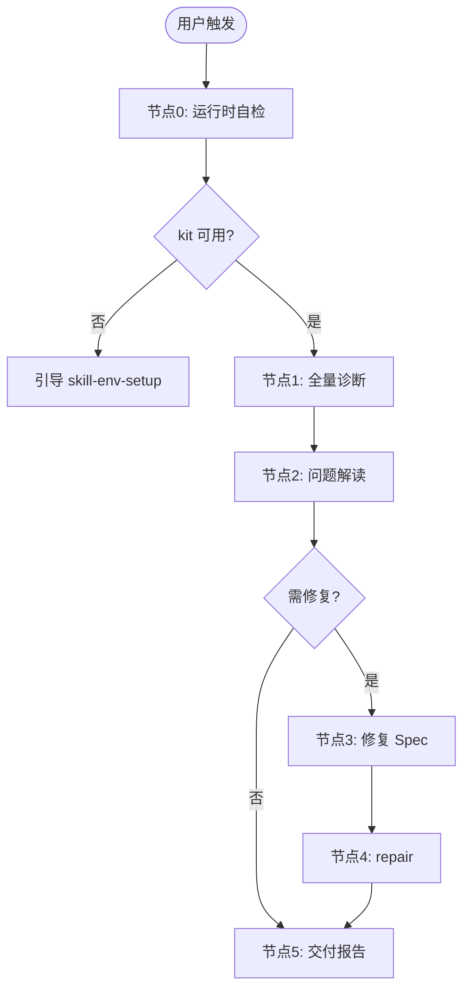

# 本地 Skill 运行时治理

**5 节点轻量工作流**：运行时自检 → 全量诊断 → 问题解读 → 修复 Spec → 执行修复与复检。

面向 **Windows 企业内网**：零预装假设、无管理员、无外网；**不**重复 skill-env-setup 的首次 onboarding。

## 流程最终目的

- **为谁服务**：已完成（或部分完成）skill-env-setup 的用户，日常使用前或业务 skill 步骤 0 失败后的运行时调优
- **解决什么问题**：skill-kit 异常、vendor 未链接、本地版本落后于 Hub、skill 依赖缺失
- **成功标准**：diagnose exit 0，或用户明确选择暂不修复且风险已说明
- **最终交付物**：诊断报告 +（可选）修复动作清单 + 复检对比
- **不应做的事**：winget/系统 Python；kit 缺失时假装 repair 可独立完成；无 Spec 直接覆盖 skill 目录

<HARD-GATE>
1. skill-kit 未安装（diagnose exit **1**）→ **禁止** repair；须引导 **skill-env-setup**。
2. 执行 repair 前须 **EnterSpecMode** 列出动作，**ExitSpecMode** 确认后才可以写 `%USERPROFILE%\.qoder-cn\` 下文件。
3. **禁止**假设系统 `python`/`git`/`pip` 可用；脚本一律经 skill-kit 的 `QODER_PYTHON`。
4. **禁止**将本 skill 当作 skill-update / skill-hub-management / skill-bootstrap 使用。
5. vendor 未链（exit **2**）→ 优先 **repair relink**，**禁止**默认重跑完整 skill-env-setup。
6. Hub 升级须 AskUserQuestion 确认；**禁止**静默覆盖全部 skill。
</HARD-GATE>

## 能力边界

### 本技能负责
- 诊断 skill-kit 与 `%USERPROFILE%\.qoder-cn\skills\` 健康状态
- 扫描各 skill 的 vendor 链接（`.pth`）与 `.installed-version`
- 可选 Hub Releases 版本对比（同 skill-env-setup 的 API 逻辑）
- 轻量修复：relink vendor、从 Hub zip 升级指定 skill
- 解读业务 skill 步骤 0 退出码 2 → vendor 修复路径

### 本技能不负责
- 首次 D1–D3 检测、凭证收集、初始化技能包全量安装 → **skill-env-setup**
- 修改 skill 内容、eval、tag/release → **skill-update**
- Hub 仓库 README/CATALOG 一致性 → **skill-hub-management**
- 创建新 skill → **skill-bootstrap**

| 场景 | 使用技能 |
|------|---------|
| 第一次用 Qoder CN，电脑无 Python/Git | **skill-env-setup** |
| skill 跑不起来，vendor import 失败 | **local-skill-runtime**（本技能） |
| 更新 skill-bootstrap 到新版本内容 | **skill-update** |
| 检查 Hub 仓库文档是否一致 | **skill-hub-management** |

## 流程概览



Read references/flow-nodes.md、references/dependency-graph.md。

## Gotchas

**1. 与 skill-env-setup 混用** — 用户说「环境有问题」就重跑 7 节点 onboarding。**纠正：kit 已存在且仅 vendor 未链 → 本 skill repair，不重装初始化包。**

**2. kit 缺失时用 winget 装 Python** — 违反零预装策略。**纠正：exit 1 → AskUserQuestion 引导 skill-env-setup。**

**3. 用系统 python 跑 scan_local_runtime.py** — 内网机可能无 Python。**纠正：diagnose 脚本内通过 `$env:QODER_PYTHON` 调用。**

**4. 跳过 EnterSpecMode 直接 repair** — 可能误覆盖 skill 目录。**纠正：节点 3 必须 Spec 列出 -RelinkAll / -UpgradeSkills 范围。**

**5. Hub 对比失败就放弃 vendor 修复** — TOKEN 缺失不应阻塞 relink。**纠正：降级为本地诊断，仍执行剧本 B。**

**6. 升级 zip 后忘记 relink vendor** — import 仍失败。**纠正：-UpgradeSkills 后对同名 skill 追加 -RelinkSkills。**

**7. 业务 skill 步骤 0 exit 2 仍引导 env-setup** — 仅 vendor 问题。**纠正：引导 **local-skill-runtime** 或 preflight 中的 repair 路径（见 skill-bootstrap portable-tools.md）。**

## 流程

### 步骤 0：运行时自检（本 skill 专用）

本 skill **不**要求自身 vendor 包；自检仅确认 skill-kit 可用（等价 kit 检查，非业务 skill 的 `-SkillDir` vendor 检查）。

```powershell
powershell -ExecutionPolicy Bypass -File scripts/diagnose_local_runtime.ps1 -KitOnly
```

- 退出码 **0** → 进入节点 1
- 退出码 **1** → AskUserQuestion 引导 **skill-env-setup**；**禁止**继续 diagnose/repair

| 问题 | header | 选项 |
|------|--------|------|
| skill-kit 未就绪，无法诊断本地运行时。如何处理？ | Kit 未就绪 | 运行 skill-env-setup 完整初始化（推荐）/ 取消 |

---

### 节点 1：全量诊断

Read references/dependency-graph.md。

```powershell
powershell -ExecutionPolicy Bypass -File scripts/diagnose_local_runtime.ps1 -CompareHub
```

输出 JSON 含：`kit`、`scan.skills`、`scan.vendor_unlinked`、`scan.hub_compare`（若 `-CompareHub`）。

**门禁**：脚本已运行；结果已解析。

---

### 节点 2：问题解读与 AskUserQuestion

按优先级分类：

| 类型 | 条件 | 剧本 |
|------|------|------|
| kit 缺失 | exit 1 | 已在步骤 0 处理 |
| vendor 未链 | `vendor_unlinked_count > 0` | repair-playbook 剧本 B |
| Hub outdated | `hub_compare.outdated` 非空 | 剧本 C |
| skill 依赖缺失 | 读 SKILL.md 依赖表后本地无目录 | 剧本 D |
| 全部健康 | exit 0 | 直接节点 5 |

若存在需修复项，调用 AskUserQuestion（1 个问题，选项随剧本见 references/repair-playbook.md）。

**示例（vendor）**：

| 问题 | header | 选项 |
|------|--------|------|
| 发现 N 个 skill 的 vendor 未链接。如何修复？ | Vendor 修复 | 全部重新链接（推荐）/ 指定 skill / 暂不修复 |

若用户选「暂不修复」，记录风险后进入节点 5，**禁止**假装已修复。

**门禁**：有问题时已 AskUserQuestion；无问题或用户已选择。

---

### 节点 3：修复 Spec 审核

EnterSpecMode，Spec 须含：

1. 诊断摘要（kit / vendor / Hub 对比）
2. 拟执行命令（`repair_local_runtime.ps1` 参数）
3. 影响范围（哪些 skill 目录会被写入）
4. 复检计划（节点 5 再次 `-CompareHub`）

ExitSpecMode 确认后进入节点 4。

Read references/repair-playbook.md。

---

### 节点 4：执行修复

```powershell
# vendor 全部重链
powershell -ExecutionPolicy Bypass -File scripts/repair_local_runtime.ps1 -RelinkAll

# 或指定 skill
powershell -ExecutionPolicy Bypass -File scripts/repair_local_runtime.ps1 -RelinkSkills @("skill-name")

# Hub zip 升级（Spec 确认后）
powershell -ExecutionPolicy Bypass -File scripts/repair_local_runtime.ps1 -UpgradeSkills @("skill-name")
```

**禁止**在本节点调用 `install_skill_kit.ps1` 替代 skill-env-setup（除非维护者明确仅修复损坏的 kit 文件且 assets 已存在——默认仍引导 env-setup）。

**门禁**：repair 退出码 0，或 errors 已解释并返回节点 2。

---

### 节点 5：复检与最终报告

```powershell
powershell -ExecutionPolicy Bypass -File scripts/diagnose_local_runtime.ps1 -CompareHub
```

**报告模板**：

```
本地 Skill 运行时诊断
════════════════════════════════════════
skill-kit：     {ready / missing}
已装 skill：    {installed_count} 个
vendor 未链：   {vendor_unlinked_count} 个（修复前 → 修复后）
Hub outdated：  {outdated_count} 个
════════════════════════════════════════
执行动作：      {actions}
建议下一步：    {若仍 exit 2，说明剩余项}
════════════════════════════════════════
```

## 异常处理

| 场景 | 处理 |
|------|------|
| diagnose exit 1 | 引导 skill-env-setup，不 repair |
| Hub API 失败 | 本地 vendor/kit 诊断仍有效；见剧本 E |
| repair 部分失败 | 报告 errors 数组，AskUserQuestion 重试或取消 |
| 用户只要检查不要修复 | 节点 2 选「暂不修复」，只交付诊断 |
| 业务 skill 步骤 0 exit 2 | 本 skill 剧本 B，非 env-setup |

## references

- `references/flow-nodes.md` — 节点表与 exit_code
- `references/dependency-graph.md` — skill-kit 根依赖与 skill 依赖表
- `references/repair-playbook.md` — **节点 3–4 必读**
- skill-kit `references/preflight.md` — 业务 skill 步骤 0 对照
- skill-env-setup `scripts/compare_skill_inventory.py` — Hub 对比逻辑同源
- skill-bootstrap `references/portable-tools.md` — 新 skill 步骤 0 与 exit 2 引导

## 依赖清单

| 依赖项 | 类型 | 说明 | 拉取方式 |
|--------|------|------|---------|
| skill-kit | 共享运行时 | 便携 Python/Git；诊断与 repair 前提 | `%USERPROFILE%\.qoder-cn\tools\skill-kit\` |
| skill-env-setup | Agent Skill | kit 或 skills 目录完全缺失 | 「配置 Qoder Skills 环境」 |
| skill-update | Agent Skill | 可选；Hub 内容升级走正式更新流程 | 已装于 `.qoder-cn\skills\` |
| GITLAB_TOKEN | 用户环境变量 | Hub 对比与 zip 下载 | skill-env-setup 节点 2 已配置 |
| AskUserQuestion | 内置工具 | 结构化选项 | 内置 |
| EnterSpecMode / ExitSpecMode | 内置工具 | repair 前计划审核 | 内置 |

## 执行后复盘（自迭代钩子）

完成后反思并记录 `evals/PITFALLS_LOG.md`（不提交 registry）。
