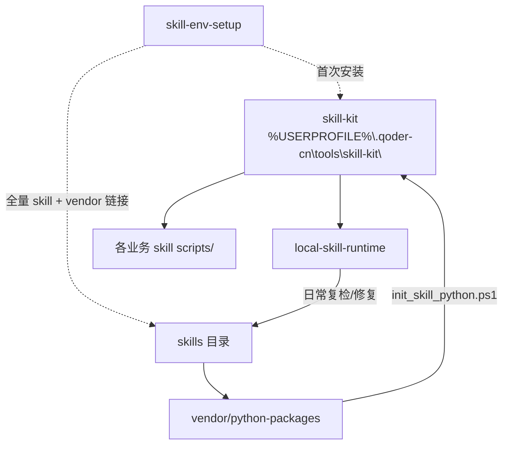

# 本地 Skill 运行时依赖图

> Read this when: 解读诊断结果或决定修复范围

## 根依赖

## 层级说明

| 层级 | 组件 | 路径 | 职责 |
|------|------|------|------|
| L0 | skill-kit | `.qoder-cn\tools\skill-kit\` | 便携 Python/Git/7za；**唯一**共享运行时 |
| L1 | skills 安装目录 | `.qoder-cn\skills\{name}\` | 各 skill 包（SKILL.md + scripts + vendor） |
| L2 | vendor 链接 | `python\Lib\site-packages\qoder-skill-{name}.pth` | 将 skill 专属 Py 库链入便携 Python |
| L3 | Hub 版本 | GitLab Releases API | `.installed-version` 与 Hub tag 对比 |

## 业务 skill 声明的 skill 依赖

部分 skill 在 SKILL.md **依赖清单** 中声明其他 Agent Skill（如 skill-env-setup）。诊断时：

1. 扫描目标 skill 的 `SKILL.md` 依赖清单表
2. 检查 `%USERPROFILE%\.qoder-cn\skills\{dep-name}\SKILL.md` 是否存在
3. 缺失 → 报告 `skill_dep_missing`，修复选项：Hub zip 安装或引导 skill-env-setup

**禁止**假设用户已全局安装被依赖 skill；以本地 `.qoder-cn\skills\` 为准。

## 修复粒度决策

| 诊断结果 | 最小修复 | 禁止默认行为 |
|---------|---------|-------------|
| kit 缺失 | 引导 **skill-env-setup** | winget / 系统 Python |
| 仅 vendor 未链 | `repair -RelinkAll` 或 `-RelinkSkills` | 重跑完整 env-setup |
| Hub outdated | `repair -UpgradeSkills` 或 skill-update | 无 Spec 直接覆盖 |
| skills 目录不存在 | skill-env-setup 节点 4 | 手动 mkdir 后假装完成 |
| GITLAB_TOKEN 缺失且需 Hub 对比 | 跳过 Hub 对比或收集 Token | 假装版本一致 |

## 与 compare_skill_inventory.py 的关系

本 skill 的 `scan_local_runtime.py --compare-hub` 使用与 skill-env-setup 节点 6 **相同**的 GitLab Releases API 与 `.installed-version` 读取逻辑，但：

- **不**要求节点 5 G1–G8 已通过（日常会话可能未跑 GitLab 全权限验证）
- API 失败时降级为「仅本地 vendor/kit 诊断」，不阻塞 vendor 修复
- 版本升级由 repair Spec 确认后执行，非 env-setup 的「首次配置完成前必问」
