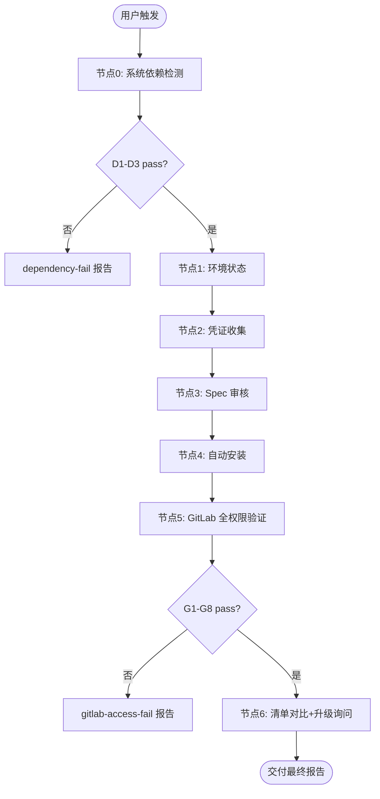

# Qoder Skills 环境初始化

**7 节点门禁工作流**：系统依赖检测 → 环境状态 → 凭证收集 → Spec 审核 → 自动安装 → GitLab 全权限验证 → 版本对比与可选升级。

## 流程最终目的

- **为谁服务**：首次使用 Qoder CN 企业版的企业内网用户（**无管理员、无外网、无预装 Python/Git**）
- **解决什么问题**：零预装环境下依赖未就绪、skill 未装全、各 skill Python 库未链接、Hub 不可达
- **成功标准**：D1–D3 pass + skill-kit 已装 + GitLab G1–G8 pass + 初始化技能包全量装入 + vendor 包已链接
- **最终交付物**：依赖/GitLab 报告 + 已装 skill 清单 +（可选）升级结果
- **不应做的事**：询问安装范围或 Git 来源；硬依赖/GitLab 未过就配置；跳过版本对比

> **默认策略（无需询问）**
> - **skill-kit**：解压 `assets/skill-kit/`（7za + python.7z + MinGit）→ `%USERPROFILE%\.qoder-cn\tools\skill-kit\`
> - **Skill**：解压 `assets/init-skills/初始化技能包.zip` **全部** → `%USERPROFILE%\.qoder-cn\skills\`
> - **Python 库**：对各 skill 的 `vendor/python-packages/` 执行 `init_all_skill_runtimes.ps1`
> - **Git**：由 skill-kit 安装 MinGit，**禁止** winget/外网/询问用户

<HARD-GATE>
1. 节点 0 硬依赖未全 pass → 禁止进入节点 1–6；须生成 dependency-fail 报告。
2. 节点 3 Spec 未 ExitSpecMode 确认 → 禁止安装/写配置。
3. 节点 5 GitLab G1–G8 未全 pass → 禁止进入节点 6，禁止声称「环境已就绪」。
4. **禁止** AskUserQuestion 询问「安装哪些 skill」「用系统 Git 还是便携 Git」。
5. **禁止**在节点 0 或节点 4 之前假设 `python`、`git`、`pip`、`curl`、`tar` 已在 PATH 中。
6. 节点 6 版本对比完成前，禁止结束流程（无 outdated 时可跳过升级询问）。
</HARD-GATE>

## 流程概览



Read references/flow-nodes.md。

## Gotchas

**1. 询问安装哪些云端 skill** — 纠正：默认解压初始化技能包.zip 全部安装，不询问。

**2. 询问外网 Git 还是便携 Git** — 纠正：无 git 则自动 MinGit，不询问。

**3. GitLab 未验证就宣布完成** — 纠正：节点 5 G1–G8 全 pass 才算配置完成。

**4. 跳过 Hub 与本地版本对比** — 纠正：节点 6 必须运行 compare_skill_inventory.py 并 AskUserQuestion 升级。

**5. 硬依赖 fail 只口头说明** — 纠正：必须 `--report-auto` 生成 dependency-fail 报告。

**6. skill 装到 ~/.qoder/skills/** — 纠正：必须 `%USERPROFILE%\.qoder-cn\skills\`。

**7. 节点 0 用 python 跑检测脚本** — 系统可能无 Python。**纠正：节点 0 仅用 `check_system_deps.ps1`（PowerShell）。**

**8. 初始化技能包缺失仍继续** — 纠正：节点 4 on_fail，禁止声称安装完成。

**9. 未安装 skill-kit 就运行各 skill 的 .py 脚本** — 纠正：节点 4.0 必须先 `install_skill_kit.ps1`，后续一律 `run_with_kit.ps1`。

**10. 各 skill 的 pip 依赖未链接** — 纠正：节点 4.6 必须 `init_all_skill_runtimes.ps1`。

**11. 节点 6 升级时不检查 skill-update 是否已安装** — Agent 直接引导用户使用 skill-update 流程，但该技能可能未安装。**纠正：在引导升级前检查 skill-update 是否可用，不可用则提供 zip 直接覆盖安装的替代方案。**

## 流程

### 节点 0：系统依赖检测（零预装）

Read references/dependency-manifest.md。

```powershell
powershell -ExecutionPolicy Bypass -File scripts/check_system_deps.ps1 -ReportAuto
```

fail → dependency-fail 报告 + AskUserQuestion 是否重检。

**门禁**：D1–D3 全 pass。**禁止**本节点调用 `python`。

---

### 节点 1：环境状态检查

| # | 检测项 | 说明 |
|---|--------|------|
| 1 | OS | 记录类型 |
| 2 | skill-kit 资源 | `assets/skill-kit/` 三件套（节点 4.0 将安装） |
| 3 | skill 目录 | `%USERPROFILE%\.qoder-cn\skills\` |
| 4 | Git 身份 | 便携 git 配置后的 user.name / email |
| 5 | GITLAB_TOKEN | 用户环境变量 |

**门禁**：五项均已检测。

---

### 节点 2：凭证收集

**不询问**安装范围、Git 来源、贡献意向。

仅收集缺失凭证：

| 缺失项 | 处理方式 |
|--------|---------|
| Git 身份 | 对话收集 name/email；若已配置则跳过 |
| GITLAB_TOKEN | 说明全权限用途 → 用户粘贴 → `set_gitlab_token` 脚本 |

若 Git 身份需确认，调用 AskUserQuestion（1 个问题）：

| 问题 | header | 选项 |
|------|--------|------|
| Git 提交者信息是否正确？ | Git 身份 | 正确，继续（推荐）/ 需要修改 |

**门禁**：Git 身份 + GITLAB_TOKEN 均已配置或已收集。

---

### 节点 3：Spec 审核

EnterSpecMode，Spec 须含：
1. 系统依赖 + 环境状态摘要（零预装假设）
2. **固定安装计划**：skill-kit（4.0）→ 目录 → Git 身份 → Token → SSL → 初始化技能包全量 → vendor 链接（4.6）
3. GitLab 验证项 G1–G8
4. 节点 6 版本对比与升级策略

ExitSpecMode 确认后进入节点 4。

---

### 节点 4：自动安装

Read references/install-commands.md、assets/init-skills/README.md、skill-kit `references/vendor-layout.md`。

**固定顺序（无分支询问）：**

| 步骤 | 动作 |
|------|------|
| 4.0 | `install_skill_kit.ps1` → `%USERPROFILE%\.qoder-cn\tools\skill-kit\` |
| 4.1 | `mkdir %USERPROFILE%\.qoder-cn\skills` |
| 4.2 | 便携 git 配置 user.name / email |
| 4.3 | `set_gitlab_token` |
| 4.4 | `git config --global http.sslVerify false` + 说明 |
| 4.5 | `run_with_kit.ps1` → `install_init_skills.py` 全量装入 |
| 4.6 | `init_all_skill_runtimes.ps1` 链接 vendor/python-packages |
| 4.7 | 每个目录 SKILL.md 含 name+description |

**门禁**：skill-kit 安装成功 + 初始化技能包全部解压 + vendor 链接已执行。

---

### 节点 5：GitLab 全权限验证

Read references/gitlab-permission-checklist.md。

```powershell
powershell -ExecutionPolicy Bypass -File scripts/run_with_kit.ps1 `
  -ScriptPath scripts/check_gitlab_access.py -ScriptArgs "--report-auto"
```

| ID | 检查项 |
|----|--------|
| G1 | GITLAB_TOKEN |
| G2 | API /user |
| G3 | 项目可读 |
| G4 | Releases 可读 |
| G5 | git ls-remote |
| G6 | write_repository / push 权限 |
| G7 | SSL |
| G8 | Git 身份 |

**门禁**：G1–G8 全 pass。fail → gitlab-access-fail 报告，返回节点 2/4 修复。

**配置完成标准**：本节点通过 = GitLab 可访问且拉取/提交权限正常。

---

### 节点 6：技能清单对比与升级询问

```powershell
powershell -ExecutionPolicy Bypass -File scripts/run_with_kit.ps1 `
  -ScriptPath scripts/compare_skill_inventory.py
```

1. **Hub 已发布清单**：GitLab Releases API（每 skill 最新 tag/version）
2. **本地已装清单**：扫描 `%USERPROFILE%\.qoder-cn\skills\` + `.installed-version`
3. 输出对比表：current / outdated / not_installed

**展示对比表**（示例）：

| Skill | Hub 版本 | 已装版本 | 状态 |
|-------|---------|---------|------|
| skill-bootstrap | v0.2.1 | v0.2.0 | outdated |

若存在 `outdated` 或 `not_installed`（Hub 有但本地无），调用 AskUserQuestion：

| 问题 | header | 选项 |
|------|--------|------|
| 发现 N 个 skill 与 Hub 版本不一致，如何处理？ | 版本升级 | 全部升级到 Hub 最新版（推荐）/ 暂不升级 / 让我指定要升级的 skill |

- **全部升级**：对每个 outdated skill 从 Hub Release 拉取最新 zip 或使用 **skill-update** 流程覆盖安装。执行前先检查 `skill-update` 技能是否在当前环境中可用（查看 `<available_skills>` 列表或检查 `%USERPROFILE%\.qoder-cn\skills\` 目录）：
  - **skill-update 可用** → 使用 skill-update 流程升级
  - **skill-update 不可用** → 使用 AskUserQuestion 提示用户：
    - 问题："skill-update 技能未安装，无法自动升级。如何处理？"
    - 选项 1（推荐）："直接拉取 zip 覆盖安装" — 从 Hub Release 下载最新 zip 解压覆盖
    - 选项 2："先安装 skill-update" — 提供安装命令后等待
    - 选项 3："暂不升级" — 记录到最终报告
- **暂不升级**：记录于最终报告，流程结束
- **指定升级**：AskUserQuestion 列出 outdated 名称供多选

**门禁**：对比脚本已运行；若有 outdated 则 AskUserQuestion 已调用。

---

### 最终报告模板

```
Qoder Skills 环境初始化完成
════════════════════════════════════════
Skill 目录：  %USERPROFILE%\.qoder-cn\skills\
skill-kit：   %USERPROFILE%\.qoder-cn\tools\skill-kit\
便携 Python： %QODER_PYTHON%
GitLab 验证： G1-G8 通过（报告路径：...）
初始化包：    {N} 个 skill 自 初始化技能包.zip
vendor 链接： {M} 个 skill 已链接 python-packages
════════════════════════════════════════
Hub 已发布：  {hub_count} 个
本地已装：    {installed_count} 个
版本一致：    {current_count} 个
需升级：      {outdated_count} 个（已处理/用户选择暂不升级）
════════════════════════════════════════
下一步：重启 Qoder CN → 直接使用 skill
```

## 异常处理

| 场景 | 处理 |
|------|------|
| 初始化技能包.zip 缺失 | 节点 4 fail；提示维护者运行 build_init_skills_bundle.py |
| git 未安装 | 由 skill-kit 4.0 安装 MinGit，不询问 |
| python 未安装 | 由 skill-kit 4.0 解压 python.7z |
| skill-kit assets 缺失 | 节点 0 D3 fail；维护者补全 assets/skill-kit/ |
| GitLab G6 push 失败 | 检查 write_repository scope |
| compare API 失败 | 确认节点 5 已通过；读 recommended-skills.md 作人工对照 |

## references

- `references/dependency-manifest.md` — 节点 0（零预装）
- `references/dependency-fail-report-template.md` — 节点 0 fail
- `references/gitlab-permission-checklist.md` — **节点 5 必读**
- `references/flow-nodes.md` — 节点表
- `references/install-commands.md` — 节点 4
- `assets/init-skills/README.md` — **初始化技能包结构**
- `assets/skill-kit/README.md` — **便携工具链资源**
- skill-kit `references/vendor-layout.md` — vendor/tools 规范
- `references/recommended-skills.md` — Hub skill 对照（API 失败降级）
- `references/gitlab-hub.md` — GitLab 地址

## 执行后复盘（自迭代钩子）

完成后反思并记录 `evals/PITFALLS_LOG.md`（不提交 registry）。


## 依赖清单

| 依赖项 | 类型 | 说明 | 拉取方式 |
|--------|------|------|---------|
| skill-kit | 共享运行时 | 便携 Python/Git；由 skill-env-setup 安装 | `%USERPROFILE%\.qoder-cn\tools\skill-kit\` |
| skill-env-setup | Agent Skill | 首次环境未就绪时安装 skill-kit | 对用户说「配置 Qoder Skills 环境」 |
